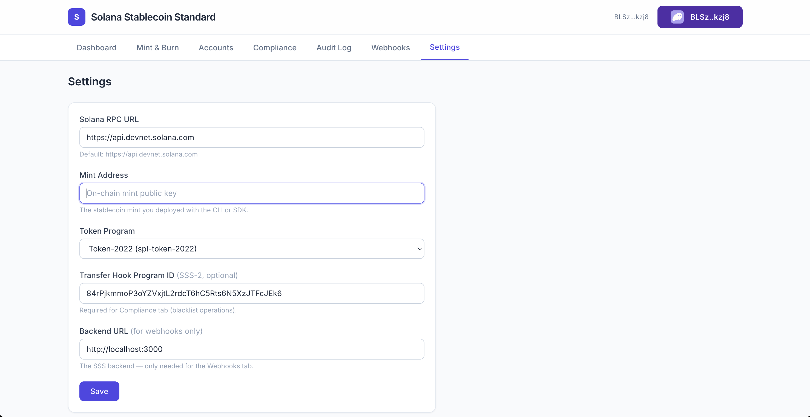
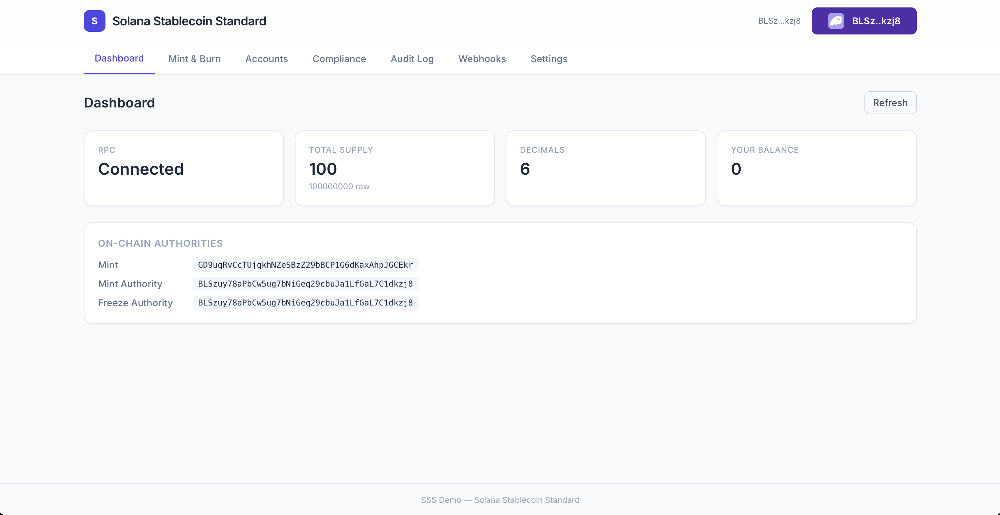
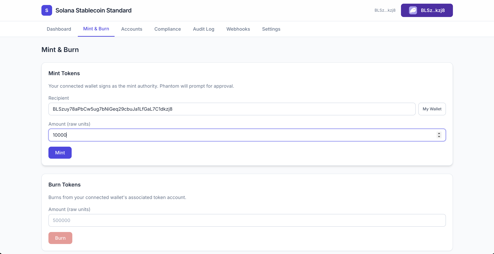
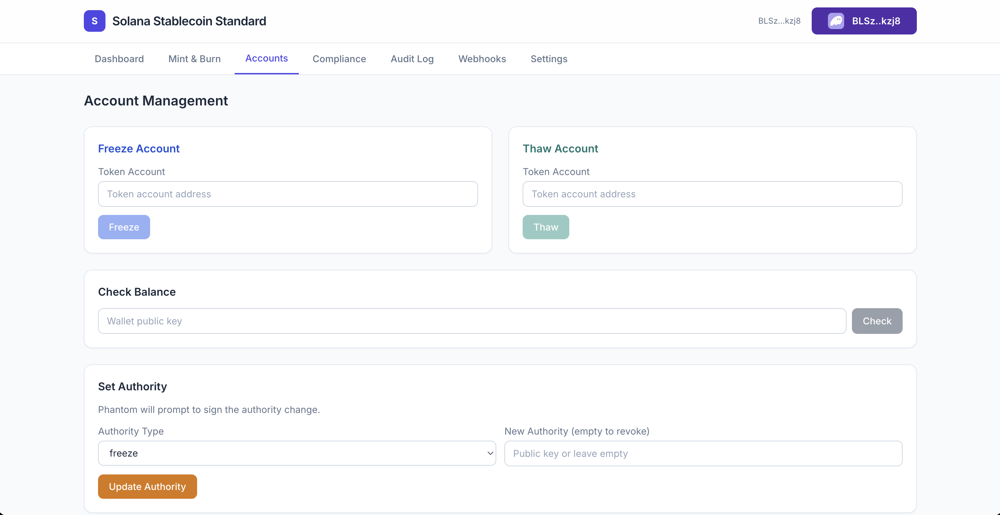
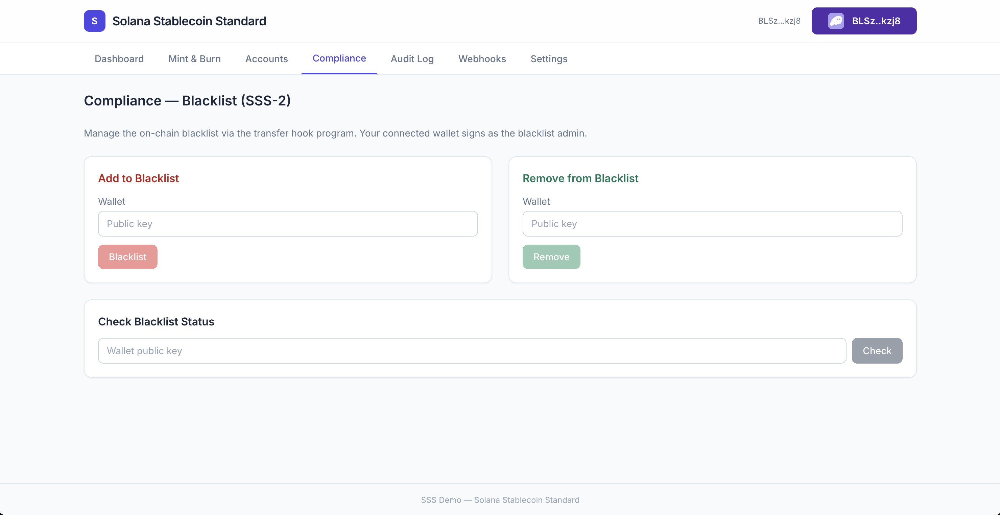

# Solana Stablecoin Standard — Documentation

## Overview

The Solana Stablecoin Standard (SSS) is a reference implementation and toolkit that defines how stablecoins should be built on Solana using the Token-2022 program. It provides two compliance presets, a full-stack toolchain, on-chain Anchor programs for both stablecoin management (sss-core) and transfer-hook compliance (blacklist hook).

### Why Token-2022?

The legacy SPL Token program treats every token the same. Token-2022 introduces **extensions** — optional features baked into the mint account at creation time. SSS leverages these extensions to give stablecoin issuers the controls they need without requiring a custom token program:

| Extension | What it does | Used by |
|-----------|-------------|---------|
| **Metadata Pointer** | Stores name, symbol, and URI directly on the mint account — no separate Metaplex account needed | SSS-1, SSS-2 |
| **Transfer Hook** | Executes a custom program on every transfer via CPI, enabling compliance checks | SSS-2 |
| **Pausable** | Allows the pause authority to halt all transfers | Optional |
| **Permanent Delegate** | Grants a permanent delegate over all token accounts (for seizure/recovery) | Optional |

### Preset Comparison

| Feature | SSS-1 | SSS-2 |
|---------|-------|-------|
| Mint / burn | Yes | Yes |
| Freeze / thaw accounts | Yes | Yes |
| On-mint metadata | Yes | Yes |
| Authority management | Yes | Yes |
| Audit log (on-chain) | Yes | Yes |
| Transfer-hook blacklist | No | Yes |
| Per-wallet block/unblock | No | Yes |
| Compliance audit export | No | Yes |
| Webhook notifications | Via backend | Via backend |

SSS-2 is a strict superset of SSS-1. Every SSS-1 operation works identically on an SSS-2 token.

---

## Quick Start

### Prerequisites

- Node.js >= 20
- Solana CLI (`solana-install`)
- A funded wallet on devnet: `solana airdrop 5`

### Deploy with the CLI

```bash
cd cli && npm install && npm run build

# 1. Create a config file (SSS-1 preset)
npx sss-token init --preset sss-1
# → creates sss-token.config.toml

# 2. Edit the config: set authority keypair paths, name, symbol

# 3. Deploy on-chain
npx sss-token init --custom sss-token.config.toml
# → deploys mint, writes mint address back into config

# 4. Operate
npx sss-token mint <recipient> 1000000
npx sss-token supply
npx sss-token status
```

### Deploy with the SDK

```typescript
import { Connection, Keypair } from "@solana/web3.js";
import { SolanaStablecoin, Presets } from "sss-token-sdk";

const connection = new Connection("https://api.devnet.solana.com", "confirmed");
const authority = Keypair.fromSecretKey(/* ... */);

const stable = await SolanaStablecoin.create(connection, {
  preset: Presets.SSS_1,
  name: "USD Stablecoin",
  symbol: "USDS",
  decimals: 6,
  authority,
});

console.log("Mint:", stable.mint.toBase58());
```

### Run the backend

```bash
cd backend && npm install
cp .env.example .env
# Set SOLANA_MINT_ADDRESS, SOLANA_KEYPAIR_PATH
npm run dev
# → REST API at http://localhost:3000
```

### Launch the demo

```bash
cd demo && npm install
npm run dev
# → http://localhost:5173
# Connect Phantom, go to Settings, paste your mint address
```

---

## Architecture Diagram

```
┌─────────────────────────────────────────────────────────────────────┐
│                         Solana Blockchain                           │
│  ┌──────────────┐  ┌──────────────────┐  ┌──────────────────────┐  │
│  │ Token-2022   │  │  Mint Account    │  │  Blacklist Hook      │  │
│  │ Program      │──│  + Metadata Ptr  │──│  Program (Anchor)    │  │
│  │              │  │  + Transfer Hook │  │  - Config PDA        │  │
│  │              │  │                  │  │  - BlacklistEntry PDAs│  │
│  └──────────────┘  └──────────────────┘  │  - ExtraAccountMetas │  │
│                                          └──────────────────────┘  │
└────────────────────────────┬────────────────────────────────────────┘
                             │
              ┌──────────────┼──────────────┐
              │              │              │
     ┌────────▼───────┐ ┌───▼────┐ ┌───────▼────────┐
     │  CLI            │ │  SDK   │ │  Backend        │
     │  (sss-token)    │ │  (npm) │ │  (Express)      │
     │  Commander      │ │        │ │  - REST API     │
     │  TOML config    │ │        │ │  - Event listener│
     └────────┬────────┘ └───┬────┘ │  - Webhooks     │
              │              │      └───────┬─────────┘
              │              │              │
              └──────────────┼──────────────┘
                             │
                    ┌────────▼────────┐
                    │  Demo (React)   │
                    │  Phantom wallet │
                    │  Tailwind UI    │
                    └─────────────────┘
```

**Data flow**: The CLI, SDK, and demo build transactions client-side and send them directly to the blockchain. The backend is an optional service that adds REST API access, on-chain event monitoring, and webhook notifications. All state lives on-chain — no database is needed.

---

## Further Reading

- [ARCHITECTURE.md](ARCHITECTURE.md) — Layer model, data flows, security
- [SDK.md](SDK.md) — Presets, custom configs, TypeScript examples
- [OPERATIONS.md](OPERATIONS.md) — Operator runbook for day-to-day management
- [SSS-1.md](SSS-1.md) — Minimal stablecoin standard specification
- [SSS-2.md](SSS-2.md) — Compliant stablecoin standard specification
- [COMPLIANCE.md](COMPLIANCE.md) — Regulatory considerations, audit trail format
- [API.md](API.md) — Backend REST API reference

---

## Demo Screenshots

The React demo app connects to Phantom and lets you manage a stablecoin directly from the browser.

### Settings

Configure the RPC endpoint, mint address, token program, and hook program ID. Settings are persisted in localStorage.



### Dashboard

Real-time view of total supply, decimals, connected wallet balance, and on-chain authorities.



### Mint & Burn

Mint tokens to any wallet (with a "My Wallet" shortcut) or burn from your ATA. Every write triggers a Phantom signature prompt.



### Account Management

Freeze/thaw token accounts, check balances for any wallet, and transfer or revoke authorities.



### Compliance (SSS-2)

Add or remove wallets from the on-chain blacklist and check blocked status — all enforced at the protocol level by the transfer hook.


